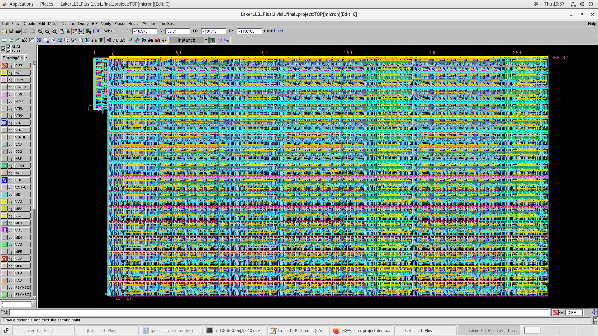

# Verified-Arithmetic-Datapath

This is the final project for the course Introduction to integrated circuits design at National Tsing Hua University. Due to the IP protection, the source code is not provided. However, the report and netlist file for presimulation are available in the repository.

This is the layout of the project:

Please refer to [report](./Team5.pdf) for more information.